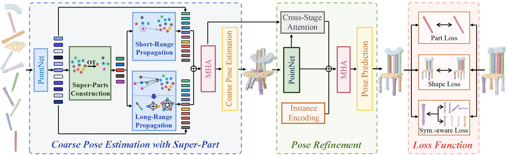

# 🚀 [NeurIPS 2025] Coarse-to-Fine 3D Part Assembly via Semantic Super-Parts and Symmetry-Aware Pose Estimation

<p align="center">
  <a href="https://arxiv.org/abs/YOUR_ARXIV_ID">
    
  </a>
  <a href="https://nips.cc/">
    
  </a>
</p>

<p align="center">
  
</p>
Figure 1: Pipeline of our CFPA. We first perform coarse pose estimation using super-parts derived via optimal transport, followed by pose refinement through cross-stage interactions. A symmetry-aware loss is proposed to improve pose accuracy while allowing structurally consistent variations.

---
## 🔧 Environment Setup 
This code was developed and tested using 4 NVIDIA RTX 4090 GPUs. To fully reproduce our results, we recommend using GPUs with equivalent configuration.
### 1. Create and Activate Conda Environment 
First, create a new Conda environment with Python 3.8 and activate it. 
``` shell 
conda create -n CFPA python=3.8
conda activate CFPA
```

### 2. Install PyTorch
Our implementation relies on GCC 9.4.0, Pytorch 1.7.1, CUDA 11.0 and Pytorch3D 0.5.0.
```shell
pip3 install torch==1.7.1+cu110 torchvision==0.8.2+cu110 torchaudio==0.7.2 -f https://download.pytorch.org/whl/torch_stable.html
```

### 3. Compile Custom CUDA Operators
Our model requires custom CUDA operators for `cd`, `emd`, and `chamfer`, which must be compiled from source.
For example, to compile the Chamfer Distance (CD) operator:
```bash
cd exps/utils/cd
python3 setup.py build develop
```

### 4. Install Other Dependencies
```bash
python -m pip install --index-url https://pypi.org/simple \
-f https://data.pyg.org/whl/torch-1.7.0+cu110.html \
torch-scatter==2.0.7 torch-sparse==0.6.9 torch-cluster==1.5.9 torch-spline-conv==1.2.1 torch-geometric==1.7.2
```

## 💾 Dataset
Download the [pre-processed](https://drive.google.com/file/d/1rZFcgEqDENsiweOnBVLc_deeQVN9CHRM/view?usp=drive_link) data for the .npy data files in file prepare_data/

## ⚡ Quick Start

